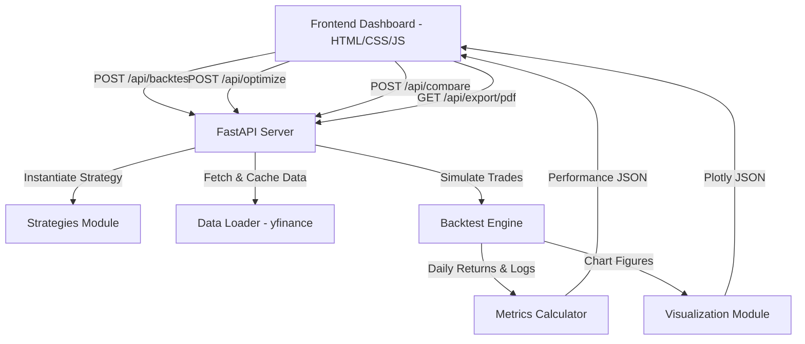

# QuantLab - Quant Research & Backtest Platform

A professional, portfolio-grade Quantitative Research and Backtesting Platform designed to simulate, optimize, and analyze technical trading strategies across multiple asset classes (Equities, Forex, Indices, and Crypto).

---

## Architecture Diagram



---

## Core Features

* **Multi-Asset Portfolio Allocation**: Support for backtesting multiple tickers at once (e.g. `AAPL, MSFT, GOOG`). Specify capital allocations inline using ticker weights (e.g. `AAPL:0.5, MSFT:0.5` or `AAPL, MSFT` for equal weighting).
* **Advanced Risk-Management Rules**:
  * **Trailing Stop-Loss**: Set a trailing stop percentage (e.g. 5%) to dynamically liquidate positions if they drop from their peak price. Stays out until the raw strategy signal resets.
  * **ATR Position Sizing**: Volatility-based sizing (Turtle style) that dynamically scales down position sizes during high-volatility regimes based on the Average True Range (ATR).
* **Monte Carlo Stress Testing**: Generates 1,000+ alternative simulated equity curves by bootstrapping historical daily returns. Displays 5%, 25%, 50% (median), 75%, and 95% confidence bands and statistical metrics:
  * **Probability of Loss**: Percentage of simulations ending below starting capital.
  * **Value at Risk (VaR)**: 95% confidence threshold for maximum terminal portfolio drawdown.
  * **Expected Shortfall (CVaR)**: Conditional expectation of loss beyond the 95% VaR threshold.
* **Global Market Tickers**: Supports any yfinance ticker (`AAPL`, `BTC-USD`, `RELIANCE.NS`, etc.).
* **Robust Data Pipeline**: Auto-cleans headers, parses dates, and caches fetched data locally.
* **7 Quant Strategies**: Buy & Hold, MA Crossover, 50-200 Trend, RSI, MACD, Bollinger Bands, and Volatility Filtering.
* **Chronological Backtest Engine**: Day-by-day execution tracking cash, portfolio value, commissions, and slippage. No lookahead bias.
* **Parameter Optimization**: Grid search with interactive 2D Heatmaps.
* **Premium Reporting**: Export logs to CSV or download print-ready PDF reports.

---

## Installation & Setup Guide

### 1. Clone & Setup Directory
Ensure the directory structure matches the layout:
```bash
git clone https://github.com/k2ksv/AlgorithmicTradingResearch.git
cd AlgorithmicTradingResearch
```

### 2. Install Dependencies
Ensure you have Python 3.10+ installed. Install the backend dependencies:
```bash
pip install -r requirements.txt
```

### 3. Launch the Application
Run the FastAPI web server from the repository root:
```bash
python -m uvicorn backend.main:app --host 0.0.0.0 --port 8000
```
Open your browser and navigate to:
```
http://localhost:8000/
```

---

## Strategy Explanations & Parameter Schema

| Strategy Name | Parameter Schema | Description |
|---|---|---|
| **Buy & Hold** | None | Invests 100% of cash on day 1 and holds. |
| **MA Crossover** | `fast_period` (default 50), `slow_period` (default 200) | Long when Fast SMA > Slow SMA, Neutral otherwise. |
| **50-200 Trend** | `ma50_period` (50), `ma200_period` (200) | Exposure: 1.0 (Close > both MAs), 0.5 (Close between MAs), 0.0 (Close < MA200). |
| **RSI Strategy** | `rsi_period` (14), `oversold_threshold` (30), `overbought_threshold` (70) | Long on oversold trigger, Neutral on overbought trigger. |
| **MACD Strategy** | `fast_period` (12), `slow_period` (26), `signal_period` (9) | Long when MACD Line > Signal Line, Neutral otherwise. |
| **Bollinger Bands** | `period` (20), `num_std` (2) | Long on lower band breach, Neutral on upper band breach. |
| **Volatility Filter** | `ma_period` (50), `vol_period` (20), `vol_threshold` (0.25) | Long on trend signal, scaled down by 50% or 100% when 20-day volatility exceeds threshold. |

---

## API Documentation

### `POST /api/backtest`
Executes backtest for a ticker (or comma-separated tickers, with optional weights) and strategy.
* **Payload**:
```json
{
  "ticker": "AAPL:0.6, MSFT:0.4",
  "start_date": "2020-01-01",
  "end_date": "2025-01-01",
  "interval": "1d",
  "strategy_name": "MA Crossover",
  "strategy_params": { "fast_period": 50, "slow_period": 200 },
  "initial_cash": 100000.0,
  "commission_rate": 0.001,
  "slippage_rate": 0.0005,
  "risk_free_rate": 0.06,
  "trailing_stop_pct": 0.05,
  "use_atr_sizing": true,
  "risk_pct": 0.02,
  "atr_multiplier": 2.0
}
```

### `POST /api/optimize`
Runs grid search over parameter ranges.
* **Payload**:
```json
{
  "ticker": "AAPL",
  "start_date": "2020-01-01",
  "end_date": "2025-01-01",
  "strategy_name": "MA Crossover",
  "param_ranges": {
    "fast_period": [10, 20, 30, 50],
    "slow_period": [100, 150, 200, 250]
  }
}
```

---

## Disclaimer
This project is for educational and research purposes only. It is not financial advice.
